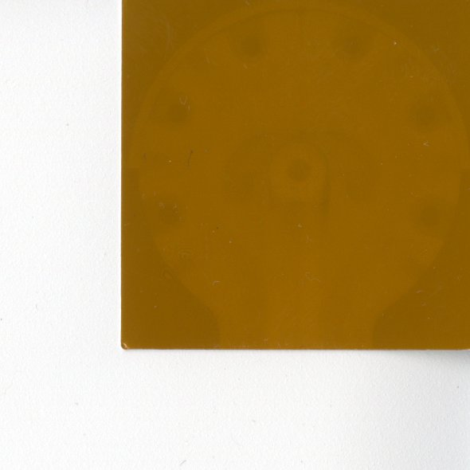
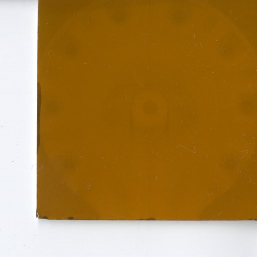

# SPICA: Source Positioning Identification in Circular Applicators

Accurate reconstruction of the source dwell positions in high-dose-rate (HDR) brachytherapy is essential for treatment quality. The Venezia™ gynaecological applicator, with its lunar-shaped ovoids, poses challenges because conventional dummy markers do not match the actual source path, introducing systematic uncertainties. This work aims to provide an automated, reproducible method for commissioning and quality assurance (QA) of these ovoids.

__Authors:__ Miquel Gubau, Adrià Casamitjana \
__Contact email:__ adria.casamitjana@udg.edu

## Contents

## 1.- General description
 The proposed methodology offers a practical, reproducible solution to improve source path verification, reduce manual 
 intervention, and enhance clinical planning accuracy. This software was tested for the lunar-shaped Venezia<sup>TM</sup> 
 applicator and the results reported on the following technical note. Please, cite this paper when using this software.

 Gubau et al., Automated evaluation of the source dwell positions in the lunar ovoids of the Venezia<sup>TM</sup> 
 gynaecological applicator (2026). (submitted)

## 2.- Installation
To run this package you just need python3 and virtualenv installed in your system. For a sanity check, you could run
``` 
which python3
which virtualenv
```
and check that the result is pointing towards an existing file in your system (and it's not empty).

To install the SPICA package, please run the following steps:
* Move into your preferred directory: ```cd /path/to/your/directory```
* Clone the GitHub repository: ```git clone https://github.com/acasamitjana/SPICA.git```
* Install python environment and the libraries required
```
virtualenv --p python3 .venv 
source .venv/bin/activate
pip install -r requirements.txt
```

## 3.- Usage

### 3.1.- Data directories

#### Autoradiographs
A set of autoradiograph images should be provided for callibration. They should all be stored in the same directory 
with the following naming convention: CXPYY*.jpg, where X and YY are numbers.
* __Channel (C)__: C1 (right channel) or C2 (left channel)
* __Source position (P)__: P01, P02, etc. where each integer correspond to a 2.5mm forward step of the souce.

For example, the file C1P01.jpg stand for channel 1 (right) and position 1 from the manufacturer.
Repetitons of the same channel and position can be stored using any suffix (e.g., C1P01-1.jpg, C1P01-2.jpg)

#### Radiographs (optional)
You could provide your own radiograph images from your hospital/center optionally:
* Images should be placed under the  same directory and with filenames starting with "rad*".
* If more than one image for the same radius is provided, they should be roughly aligned and the program will use the 
redundancy of these images for a more robust estimate of the ovoid characteristics. 
* Only images of the same radius should be placed under each directory (the software does not distinguish between them)


If no radiographs are available, we provide the following radiographs 
for available  each diameter:

22 cm                          |  26 cm
:-----------------------------:|:-------------------------:
 |  


### 3.2.- Run the SPICA software

Open a local terminal:
* Change directory to the project root. 
* Activate your local environment
* Then execute the app.py file
```
cd /path/to/this/software
source .venv/bin/activate
spica
```
Now, you will be asked some important information through command line:
* __Ovoid size:__ choose from 22/26/30
* __Running mode:__ choose from QA/COMMISSIONING/CUSTOM
* __Directory of radiograph images:__ navigate to the autoradiograph directory or press "Cancel" if not available.
* __Directory of the autoradiograph images:__ navigate to the autoradiograph directory.

### 3.3.- Output
The SPICA software has two separate outcomes:
* Quantitative results: it stores the calculated dwell positions for the different channels and source positions. It 
  also stores the associated type-A uncertainties.
* Visualization: it shows the theoretical and the computed dwell positions and hole centers among all available channels,
  source positions and repetitions.

## 4. Step-by-step example
In the directory ```example``` we include a notebook with step-by-step guide of the pipeline for visualization purposes
